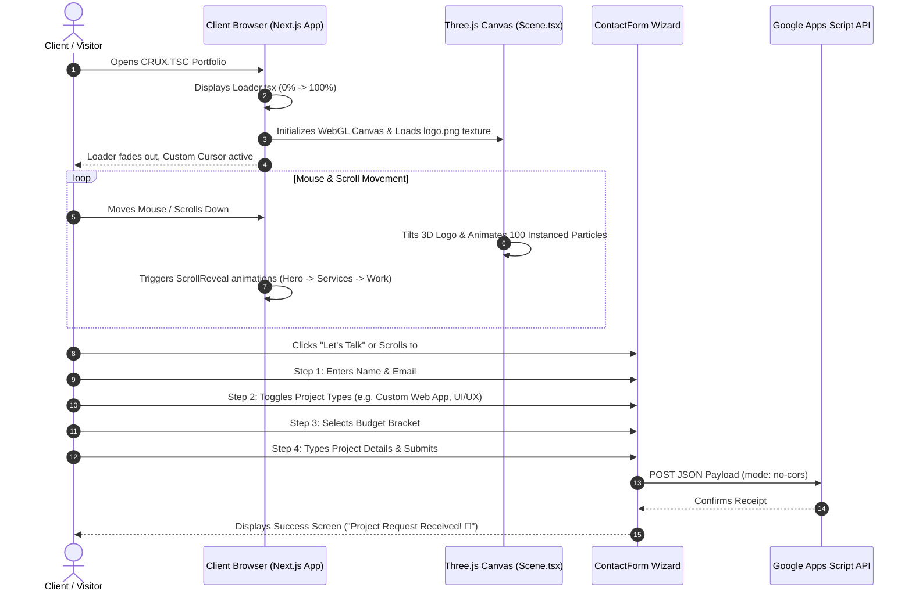

# 🧠 CRUX.TSC — Agency Portfolio Memory Map

> **Comprehensive Architectural, Structural & Component Memory Map**  
> *Last Updated: July 2026* • *Project: CRUX.TSC Creative Digital Agency Portfolio*

---

## 🏛️ Executive Summary & Tech Stack

**CRUX.TSC** is a premium, high-performance creative agency portfolio designed with state-of-the-art web aesthetics, interactive 3D graphics, and smooth micro-animations. It operates as a modern Single-Page Application (SPA) built on top of the **Next.js App Router** structure.

### ⚡ Core Technology Stack
- **Framework:** [Next.js 16.2.10](https://nextjs.org/) (App Router, Client/Server Components)
- **Library:** [React 19.2.4](https://react.dev/) & [TypeScript 5](https://www.typescriptlang.org/)
- **3D & Canvas Rendering:** [Three.js r185](https://threejs.org/), [@react-three/fiber 9.6.1](https://docs.pmnd.rs/react-three-fiber/), [@react-three/drei 10.7.7](https://github.com/pmndrs/drei)
- **Animations & Transitions:** [Framer Motion 12.42.2](https://www.framer.com/motion/) & Custom CSS Keyframes
- **Styling Design System:** Vanilla CSS (`globals.css`) using custom HSL/Hex variables, Glassmorphism (`.glass-card`), and curated typography (`Space Grotesk` & `Inter`).
- **Form Handling & Lead Generation:** Client-side multi-step wizard connected directly to a Google Apps Script Webhook.

---

## 📂 Codebase & Directory Tree Map

```
d:\crux\
├── 📁 public\                     # Static Media & Brand Assets
│   ├── 📄 logo.png                # Primary brand logo (used across navbar, loader, 3D scene)
│   ├── 📄 icon.png                # Favicon / App icon
│   ├── 🖼️ project1.png - project4 # Selected work thumbnails (MND Designs, etc.)
│   ├── 🖼️ miraiglobalpolymers.png # Portfolio thumbnail
│   ├── 🖼️ theaugrandair.png       # Portfolio thumbnail
│   ├── 🖼️ klothix.png             # Portfolio thumbnail
│   ├── 🖼️ travelsamurais.png      # Portfolio thumbnail
│   ├── 🖼️ thecareergadget.png     # Portfolio thumbnail
│   ├── 🖼️ healingourth.png        # Portfolio thumbnail
│   └── 🖼️ consideritdone.png      # Portfolio thumbnail
│
├── 📁 src\                        # Source Application Code
│   ├── 📁 app\                    # Next.js App Router Core
│   │   ├── 📄 layout.tsx          # Root layout with global fonts, Navbar, and Footer wrapper
│   │   ├── 📄 page.tsx            # Main single-page portfolio assembling all sections & data
│   │   ├── 📄 globals.css         # Complete design token definitions, variables & utility classes
│   │   └── 📄 page.module.css     # Localized module styles (supplementary)
│   │
│   └── 📁 components\             # UI & Interactive Components
│       ├── 📄 Navbar.tsx          # Fixed header with scroll-aware glassmorphism & navigation links
│       ├── 📄 Footer.tsx          # Rich multi-column footer with contact info & social links
│       ├── 📄 Loader.tsx          # Initial full-screen loading screen with animated progress bar
│       ├── 📄 CustomCursor.tsx    # Interactive dual-ring/dot custom cursor with hover state scaling
│       ├── 📄 ScrollReveal.tsx    # Reusable Framer Motion viewport entrance animation wrapper
│       ├── 📄 Marquee.tsx         # Infinite scrolling typography ticker (`WEB DEVELOPMENT ★ ...`)
│       ├── 📄 AnimatedCounter.tsx # Intersection-observer triggered cubic-easing number counter
│       ├── 📄 TechStack.tsx       # Categorized grid of design tools, frontend, backend & databases
│       ├── 📄 FAQ.tsx             # Animated accordion for client transparency & common questions
│       ├── 📄 ContactForm.tsx     # 4-Step interactive project inquiry wizard with webhook POST
│       ├── 📄 ProjectCard.tsx     # macOS browser window card with live iframe demo & interaction toggle
│       ├── 📄 ProjectDemoModal.tsx # Fullscreen interactive modal with desktop/tablet/mobile viewports
│       ├── 📄 FreeAuditSection.tsx # Top-of-funnel lead magnet for free 24-hr UX/speed video breakdowns
│       │
│       └── 📁 three\              # 3D Canvas & WebGL Components
│           └── 📄 Scene.tsx       # R3F Canvas rendering AnimatedLogo, Particles & FloatingAccents
│
├── ⚙️ package.json                # Dependency manifest and npm scripts (`dev`, `build`, `start`, `lint`)
├── ⚙️ next.config.ts              # Next.js configuration (`reactStrictMode: false` for Three.js stability)
├── ⚙️ tsconfig.json               # TypeScript compiler options and `@/*` path mapping
└── 📄 README.md / AGENTS.md       # Project guidelines and Next.js modern conventions
```

---

## 🗺️ Component Hierarchy & Architecture Flow

```mermaid
graph TD
    RootLayout[RootLayout<br/>src/app/layout.tsx] --> Navbar[Navbar.tsx]
    RootLayout --> MainContent[Main Content<br/>src/app/page.tsx]
    RootLayout --> Footer[Footer.tsx]

    subgraph Global Overlays [Client Overlays & WebGL]
        MainContent --> Loader[Loader.tsx<br/>Progress Screen]
        MainContent --> CustomCursor[CustomCursor.tsx<br/>Dual Ring Pointer]
        MainContent --> Scene[Scene.tsx<br/>Three.js R3F Canvas]
    end

    subgraph Page Sections [Sequential Page Sections]
        MainContent --> HeroSection[Hero Section]
        MainContent --> Marquee1[Marquee.tsx<br/>Ticker 1]
        MainContent --> ServicesSection[Services Section<br/>6 Glass Cards]
        MainContent --> TechStackSection[Tech Stack Section<br/>TechStack.tsx]
        MainContent --> PortfolioSection[Selected Work Section<br/>8 ProjectCards + Case Study Metrics]
        MainContent --> FreeAuditSection[Free Audit Section<br/>FreeAuditSection.tsx]
        MainContent --> AboutSection[About / Stats Section]
        MainContent --> Marquee2[Marquee.tsx<br/>Ticker 2]
        MainContent --> TestimonialsSection[Testimonials Section<br/>3 Client Quotes]
        MainContent --> ProcessSection[Process Section<br/>4 Step Roadmap]
        MainContent --> FAQSection[FAQ Section<br/>FAQ.tsx Accordion]
        MainContent --> ContactSection[Contact & CTA Section]
    end

    PortfolioSection --> ProjectCard[ProjectCard.tsx<br/>macOS Iframe Card]
    PortfolioSection --> ProjectDemoModal[ProjectDemoModal.tsx<br/>Fullscreen Device Viewport Modal]
    AboutSection --> AnimatedCounter[AnimatedCounter.tsx<br/>Stats Counters]
    ContactSection --> ContactForm[ContactForm.tsx<br/>4-Step Wizard]

    HeroSection -. wrapped in .-> ScrollReveal[ScrollReveal.tsx]
    ServicesSection -. wrapped in .-> ScrollReveal
    PortfolioSection -. wrapped in .-> ScrollReveal
    AboutSection -. wrapped in .-> ScrollReveal
    TestimonialsSection -. wrapped in .-> ScrollReveal
    ProcessSection -. wrapped in .-> ScrollReveal
    FAQSection -. wrapped in .-> ScrollReveal
    ContactSection -. wrapped in .-> ScrollReveal
```



---

## 🔍 Detailed Component Reference & Anatomy

### 1. Root & Single-Page Structure
* **[layout.tsx](file:///d:/crux/src/app/layout.tsx)**: Configures HTML metadata (`CRUX.TSC — Creative Digital Agency`), imports `globals.css`, and wraps the application within `<Navbar />`, `<main>`, and `<Footer />`.
* **[page.tsx](file:///d:/crux/src/app/page.tsx)**: The main orchestrator (marked `"use client"`). Dynamically imports `Scene` with `{ ssr: false }` to prevent WebGL server-side rendering errors. Contains embedded datasets:
  * `projects`: Array of 8 portfolio projects with live links, tags, descriptions, and thumbnails.
  * `services`: Array of 6 core services (Web/App, UI/UX, Brand Kit, Graphics, Social Media, Strategy) with custom gradient backgrounds.
  * `testimonials`: Client quotes from tech CEOs and founders.

---

### 2. Global Interactive Overlays
* **[Loader.tsx](file:///d:/crux/src/components/Loader.tsx)**:
  * **Functionality:** Full-screen initial loading experience fixed at `z-index: 99999`.
  * **Mechanics:** Increments progress state via interval until `100%`, triggers a pulsating logo animation, and gracefully fades out (`scale(1.1)`, opacity `0`) before removing pointer events.
* **[CustomCursor.tsx](file:///d:/crux/src/components/CustomCursor.tsx)**:
  * **Functionality:** Replaces standard OS cursor (`* { cursor: none !important; }`) on fine-pointer devices (`@media (pointer: fine)`).
  * **Mechanics:** Uses `requestAnimationFrame` with linear interpolation (`LERP 0.1`) for smooth outer ring lagging behind an instant inner red dot (`#ff0000`).
  * **Interactivity:** Attaches `mouseenter` / `mouseleave` event listeners to interactive elements (`a`, `button`, `.glass-card`, `.project-card`, `.testimonial-card`, `.process-step`) to expand the ring size from `36px` to `64px` and add a subtle red fill.
* **[Scene.tsx](file:///d:/crux/src/components/three/Scene.tsx)**:
  * **Functionality:** Fixed background 3D canvas (`z-index: 0`, pointer events disabled) rendered via `@react-three/fiber`.
  * **Sub-components:**
    * `<AnimatedLogo />`: Loads `/logo.png` texture onto dual mirrored planes (`2.8x2.8`) with a red ring behind it. Rotates continuously and tilts dynamically based on mouse coordinates.
    * `<Particles count={100} />`: Uses `THREE.InstancedMesh` with sine/cosine equations to animate 100 floating spheres across viewport space in brand colors (`#ff0000`, `#ffed00`, `#7f1c5f`, `#421553`).
    * `<FloatingAccents />`: Renders floating geometric primitives (Torus in yellow, Icosahedron in magenta, Dodecahedron in purple) wrapped in `@react-three/drei` `<Float />` wrappers.

---

### 3. Reusable UI Components
* **[ScrollReveal.tsx](file:///d:/crux/src/components/ScrollReveal.tsx)**:
  * Uses Framer Motion's `useInView` (`margin: '-80px'`) to trigger entrance animations (`up`, `left`, `right`) with custom cubic-bezier easing `[0.25, 0.46, 0.45, 0.94]`.
* **[AnimatedCounter.tsx](file:///d:/crux/src/components/AnimatedCounter.tsx)**:
  * Uses `IntersectionObserver` to trigger a high-performance `requestAnimationFrame` loop calculating cubic ease-out numbers (`50+ Projects`, `30+ Clients`, `3+ Years`, `10+ Team`).
* **[Marquee.tsx](file:///d:/crux/src/components/Marquee.tsx)**:
  * Continuous 25s CSS keyframe loop (`marquee`) duplicating text chunks three times (`WEB DEVELOPMENT ★ UI/UX DESIGN ★ ...`) for seamless ticker scrolling.
* **[TechStack.tsx](file:///d:/crux/src/components/TechStack.tsx)**:
  * 3-column responsive grid categorizing tools (`Figma`, `Next.js`, `PostgreSQL`, `React Native`, etc.) with color-coded category indicators.
* **[FAQ.tsx](file:///d:/crux/src/components/FAQ.tsx)**:
  * Client-side state tracking `openIndex`. Uses Framer Motion's `<AnimatePresence>` and `<motion.div>` for smooth height transitions (`height: 'auto'`) and `+` icon 45-degree rotation.
* **[ProjectCard.tsx](file:///d:/crux/src/components/ProjectCard.tsx)**:
  * Renders each project inside a sleek macOS browser frame (`● ● ●` controls and address bar `🔒 hostname`).
  * Displays **Quantifiable ROI & Business Impact metrics** (`🚀 +140% Inquiry Rate` • `⚡ 0.8s Page Load`) right inside the overlay.
  * Features dual-view support: live interactive lazy-loaded `iframe` or clean thumbnail view (`viewMode = 'image'` default), plus an inline `🟢 Live Interactive Mode` toggle.
* **[ProjectDemoModal.tsx](file:///d:/crux/src/components/ProjectDemoModal.tsx)**:
  * Fullscreen Framer Motion overlay (`AnimatePresence`) for testing live websites with responsive viewport toggles: `💻 Desktop` (`100%`), `📟 Tablet` (`768px`), and `📱 Mobile` (`375px`), plus a dedicated Case Study & ROI Banner.
* **[FreeAuditSection.tsx](file:///d:/crux/src/components/FreeAuditSection.tsx)**:
  * High-converting top-of-funnel lead magnet container placed after the Selected Work section.
  * Offers a 100% free 24-hour custom Loom video audit uncovering UX bottlenecks and speed issues. Submits directly to the Google Apps Script Webhook (`mode: "no-cors"`).

---

### 4. Interactive Lead Generation (Contact Form)
* **[ContactForm.tsx](file:///d:/crux/src/components/ContactForm.tsx)**:
  * **Multi-Step State:** `step` (1 to 4) with visual progress bar indicator.
    * **Step 1:** Name & Email inputs.
    * **Step 2:** Interactive grid selection for Project Types (`Landing Page`, `Custom Web App`, `Mobile App`, `UI/UX Design`, `Brand Kit`, `Social Media`).
    * **Step 3:** Budget bracket selection (`Under ₹10,000` to `₹1,00,000+`).
    * **Step 4:** Textarea for specific requirements and links.
  * **Submission:** Sends `POST` request (`mode: "no-cors"`) to Google Apps Script Webhook URL (`script.google.com/macros/s/.../exec`). Transitions to a success screen with animated checkmark/rocket upon completion.

---

## 🎨 Design System & CSS Tokens (`globals.css`)

The project follows a strict **Vanilla CSS Token System** defined in `:root`:

| Token / Class | Value / Definition | Usage / Description |
| :--- | :--- | :--- |
| `--crux-bg` | `#f8f6f5` | Warm, clean off-white canvas background |
| `--crux-yellow` | `#ffed00` | Vibrant electric yellow accent |
| `--crux-red` | `#ff0000` | Primary brand red (used for buttons, cursors, rings) |
| `--crux-magenta` | `#7f1c5f` | Deep magenta (used in gradients & glass card badges) |
| `--crux-purple` | `#421553` | Rich violet/purple (used in gradients & testimonials section) |
| `--crux-black` | `#000000` | Pure black for high-contrast heading typography |
| `--font-heading` | `'Space Grotesk', sans-serif` | Bold, modern technical geometric typography |
| `--font-body` | `'Inter', sans-serif` | Clean, highly legible UI reading font |
| `.gradient-text` | `linear-gradient(135deg, red, magenta, purple)` | Multi-color gradient fill for key headline words |
| `.glass-card` | `background: rgba(255,255,255,0.7)` + `backdrop-filter: blur(12px)` | Glassmorphic card container with hover elevation (`translateY(-8px)`) |
| `.btn-primary` | `linear-gradient(135deg, red, magenta)` + pill border (`50px`) | Primary action button with animated light sheen pseudo-element (`::after`) |

---

## 🔄 User Interaction & Lead Flow



---

## 🛠️ Maintenance & Expansion Guide

1. **Adding New Portfolio Projects:**
   - Open `src/app/page.tsx` and append a new object to the `projects` array (`img`, `title`, `tag`, `desc`, `link`). Ensure the thumbnail image (`.png` or `.webp`) is dropped into `public/`.
2. **Modifying Agency Services:**
   - Update the `services` array in `src/app/page.tsx`. Each service requires an `icon` character, `title`, `desc`, and a `bg` gradient string.
3. **Updating Form Lead Destination:**
   - In `src/components/ContactForm.tsx`, modify `WEBHOOK_URL` (`line 25`) if migrating from Google Apps Script to a dedicated backend, Supabase, or CRM (HubSpot / Zoho).
4. **WebGL & Performance Tuning:**
   - Particle count (`count={100}`) and float intensity can be adjusted inside `src/components/three/Scene.tsx`. The Three.js scene runs with `antialias: true` and `toneMapped: false` for maximum color vibrancy.
